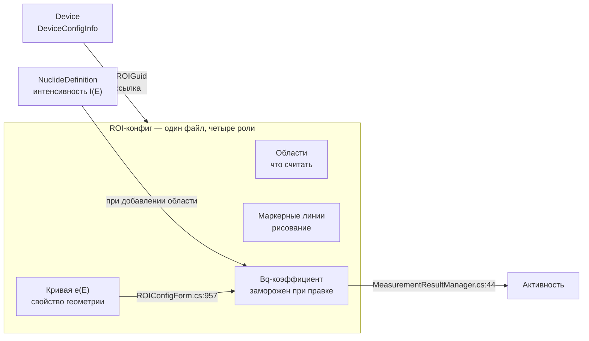
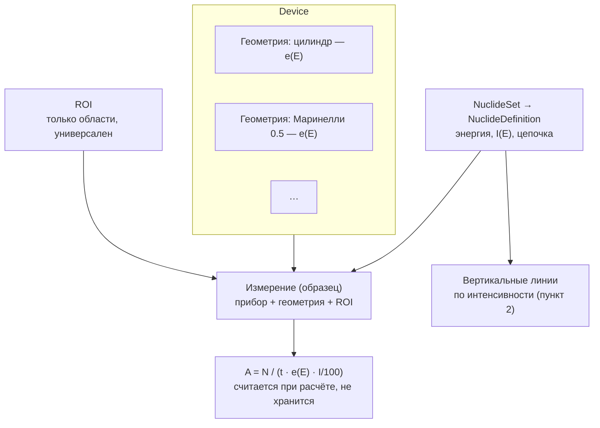
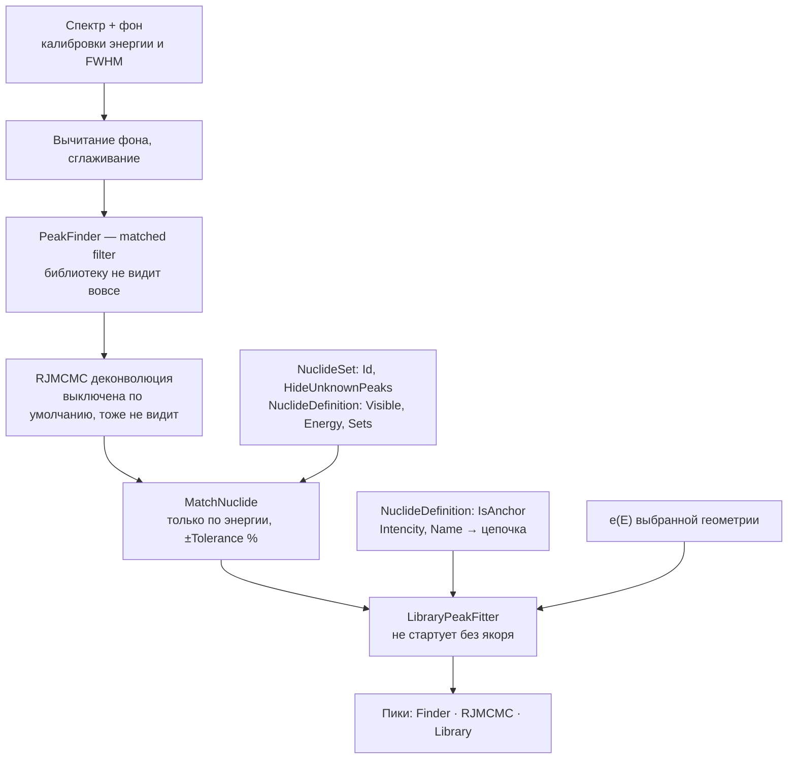

# Архитектурный рефакторинг: величины, у которых нет своего места

## Коротко

Несколько первичных величин хранятся внутри чужих сущностей. Отсюда четыре правки:

| # | Что | Одной фразой |
|---|---|---|
| 1 | Цепочка распада | вынести из скобок в имени в отдельное поле |
| 2 | Коэффициент в Бк | считать при расчёте, а не замораживать при правке области |
| 3 | Кривые эффективности | список геометрий у прибора; ROI перестаёт быть привязан к железу |
| 4 | Вертикальные линии | рисовать из `NuclideSet`, а не из ROI |

**Ключ — пункт 2:** пока коэффициент вморожен в область, ROI не может быть универсальным,
а кривая не может уехать из ROI. Порядок работ: 1 → 2 → 3 → 4.

**Отдельный открытый вопрос:** нужен документ, фиксирующий результат измерения. Сегодня
пики и посчитанные активности не сохраняются вовсе — только входные данные.

Ничего не начато. Ниже — обоснования, адреса в коде и мины миграции; читать по надобности.

---

**Дата фиксации:** 30.07.2026
**Обсуждение:** [PR #32, комментарий 5130639108](https://github.com/Am6er/BecqMoni/pull/32#issuecomment-5130639108)
**Статус:** позиция Amber предъявлена, ответ Verter73 ожидается. Ни один пункт не начат.

> **Поправка от 30.07.2026, вечер — важная.** Первая редакция этого документа утверждала,
> что кривая эффективности остаётся в ROI. Это неверно, разбор в разделе
> «[Модель связей](#модель-связей)». Пункт 3 переписан полностью, пункт 2 подправлен.
> Прежний вывод сохранён в журнале решений — он показателен как ошибка.

Документ рабочий и пополняемый. Его задача — чтобы к моменту, когда до правок дойдут руки,
не пришлось заново искать, где именно конвенция несущая и что сломается при миграции.
Все адреса в коде проверены на `roi-wizard-reworked` @ `d80c7ee`; при расхождении верить коду,
а не документу, и документ править.

---

## Общий диагноз

Обсуждаемые пункты — один и тот же дефект в разных костюмах: **величина, первичная
по физике, не имеет своего места и живёт внутри чужой сущности.**

| Величина | Где живёт сейчас | Чем это оборачивается |
|---|---|---|
| Идентификатор цепочки распада | текст в последних скобках `NuclideDefinition.Name` | три разошедшихся парсера, ложные срабатывания на вторичных линиях |
| Вертикальные линии по интенсивности | неиспользуемые поля измерительной записи `ROIDefinitionData` | области, которые ничего не измеряют, но выглядят настроенными |
| Набор геометрий прибора | по одной кривой на ROI-конфиг, одна ссылка на устройство | список нуклидов размножен по устройствам и сосудам |
| Коэффициент пересчёта в Бк | заморожен в записи области при её редактировании | ROI перестал быть универсальным, хотя задуман таким |
| Кривая эффективности при расчёте дозы | свёрнута внутрь `Sensitivity` дозовой точки | одна кривая грузится в форму дважды двумя несвязанными путями |

---

## Модель связей

### Как задумано (словами Amber)

- Один **Device** может иметь **множество геометрий** — кривых эффективности.
- **ROI** — список областей, где считается активность. Он **универсален**: поля вида
  Cs-137, K-40 не зависят от конкретного прибора, это то, что пользователь решил считать.
  Ему лишь нужно подать на вход нужную кривую — тогда автоматом выставится нужный
  коэффициент.
- **NuclideDefinition** — сборник нуклидов с их атрибутами.
- **NuclideSet** — сборник элементов `NuclideDefinition`.

### Как есть в коде



### Как должно быть



### Где была ошибка

Неверный шаг рассуждения: **«коэффициент автозаполняется из кривой → значит кривая должна
лежать рядом с областями → значит остаётся в ROI»**.

По самой же модели ROI универсален и кросс-device. Значит в нём не может лежать ни кривая
(свойство геометрии), ни `BecquerelCoefficient` (свойство пары «область × геометрия»).
А он там лежит:

- `ROIConfigForm.cs:951-960` — при добавлении области из нуклида, если у конфига есть
  кривая, считается `BecquerelCoefficient = (1 / ε(E)) / (I / 100)` и **записывается
  в файл**;
- `MeasurementResultManager.cs:44-45` — расчёт активности берёт уже готовое число
  и кривую больше не спрашивает.

**Универсальным ROI быть не даёт именно замороженный коэффициент, а не кривая.** Кривую
положили рядом потому, что коэффициент считается в момент редактирования — ей больше
неоткуда взяться. Поставочное дерево показывает это прямо: `config/ROI/Atom Nano 3.xml`,
`Atom Nano 8.xml`, `Atom Spectra 2 Маринелли 40х40.xml` — одни и те же линии Cs-137/K-40,
разные `BecquerelCoefficient`. Список нуклидов размножен по приборам ровно потому, что
в него вмонтирован результат.

Правильный путь в коде **уже есть**: `EnergySpectrumView.cs:724-749` считает тот же
коэффициент на лету — из `roiConfig` и `Nuclide.Intencity` — для показа активности по
одному пику на графике. То есть в приложении сосуществуют оба способа, и «правильный»
работает; по замороженному идёт только таблица ROI.

### Ось, которой нет вовсе — решено

**Выбор геометрии для конкретного образца.** `EfficencyROIGuid` — одна ссылка на
устройство, то есть у прибора фактически одна активная геометрия, а смена сосуда сегодня
делается подменой ROI-конфига целиком.

**Решение (30.07.2026):** геометрия живёт в **`SampleInfoData`**, рядом с `Location`,
`Time`, `Weight`, `Volume` — это свойство пробоподготовки, а не прибора и не ROI. Плюс
**геометрия по умолчанию в настройках детектора**, ровно как там уже задан фон по
умолчанию (`DeviceConfigInfo.BackgroundSpectrumPathname`): новое измерение берёт её
оттуда, а карточка образца может переопределить.

Из этого следует и порядок разрешения при расчёте:
`SampleInfoData.Geometry` → иначе умолчание устройства → иначе «геометрия не выбрана»,
и это состояние должно быть видно, а не молча превращаться в чужую кривую.

---

## Правила, общие для всех пунктов

Собраны отдельно, потому что нарушение любого из них ломает пользовательские файлы тихо.

1. **`XmlSerializer` здесь без `Order=`.** Добавление необязательного элемента совместимо
   в обе стороны: старый файл оставит поле в значении по умолчанию, старая сборка
   проигнорирует незнакомый элемент. Именно так в своё время добавили `IsAnchor`
   (`NuclideDefinition.cs:152`) и `EfficencyROIGuid`.
2. **Обработчиков `UnknownElement`/`UnknownNode` в решении нет вообще.** Незнакомые данные
   пропадают молча — предупредить пользователя некому.
3. **Главный риск — не чтение, а обратная запись.** Выпущенная сборка, прочитав новый файл
   и сохранив его, вычистит все новые элементы. Отсюда общее правило: **новое поле —
   формализация поверх существующего представления, а не замена ему**, пока в ходу сборки
   без этого поля.
4. **`DeviceConfigInfo.FormatVersion` не бампать.** `DeviceConfigManager.cs:82` любое
   значение кроме `"120920"` уводит файл в `_097b`-десериализатор.
5. **Опечатку `Efficency` (одна «i») не чинить.** Это имя XML-элемента; переименование
   молча оборвёт связь у устройств, где он уже проставлен.
6. **Два дерева конфигов.** `config/` и `BecquerelMonitor/config/` — побайтовые копии;
   правя одно, править и второе.
7. **Поставочные конфиги достаются только новым пользователям.** `MainForm.cs:102` копирует
   их, только если каталога `%AppData%\BecqMoni\config` нет вовсе. На обновлении не
   копируется ничего. Любая миграция — это рантайм-код, идемпотентный, а не правка файлов
   в репозитории.
8. **Дубли GUID отбрасываются молча.** `ROIConfigManager` и `DeviceConfigManager` при
   совпадении Guid показывают диалог и **выбрасывают** позднюю запись. Поставлять
   что-либо с фиксированным Guid поэтому опасно: пользователь мог импортировать то же
   самое сам.
9. **Всё, что пользователь мог ввести руками, побеждает расчётное.** Это касается и
   `BecquerelCoefficient` (`ROIConfigForm.cs:742/888` — поле ввода), и
   `DoseRateCalibrationPoints`. Расчёт заполняет пустое, а не переписывает заданное.

---

## Пункт 1. Идентификатор цепочки в `NuclideDefinition`

### Решение

Необязательное поле с **корнем ряда в каноничном виде** (`U-238`, `Th-232`) — не машинный
слаг `u238` из `nucdb.chains`.

Причина выбора: ровно это значение возвращает сегодняшний `ChainOf(Name)`. Поле и fallback
дают одно и то же, поэтому их можно сверять между собой и валидировать; и человек может
ввести значение руками в `NuclideDefinitionForm` без таблицы соответствий.

Заполняется при формировании из roi-wizard/`nucdb` (готовый ответ уже есть —
`CatalogNuclide.Chain` и `NuclideCatalog.ChainRoot()`) либо пользователем.

### Что сейчас держится на конвенции скобок

| Адрес | Что делает | После правки |
|---|---|---|
| `LibraryPeakFitter.cs:952` `ChainOf` | эталон: последние скобки, иначе имя целиком | становится общей функцией `Chain ?? ChainOf(Name)` |
| `RoiWizard/SetChecker.cs:279` `ChainOf` | копия: требует `)` последним символом, без скобок → `null` | удаляется, зовёт общую |
| `RoiWizard/SpectralLine.cs` `LibraryName` / `EndsWithBrackets` | производитель имени со скобками | остаётся, плюс проставляет поле |
| `RoiWizard/LineSetBuilder.cs:206` | `partOfSeries = label != nuclide.Name` — на этом висит пересчёт равновесия | признак берётся из поля |
| `RoiWizard/LineSetBuilder.cs` `WithSuffix` | вставляет суффикс ХРИ **перед** скобками, чтобы конвенция уцелела | упрощается |
| `RoiWizard/LineMerger.cs` | копирует `OwnerLabel` у слитой линии, чтобы имя не поехало | обязан копировать и новое поле |
| `NucBase/NucBase.cs:~503` | импорт ряда дописывает `" (" + корень + ")"` | заполняет поле |
| `LibraryPeakFitter.cs:~604` | группировка по цепочке для BR-связки | читает поле |

### Расхождение, которое надо закрыть первым

`SetChecker.ChainOf` и `LibraryPeakFitter.ChainOf` дают разные ответы: для имени без скобок
первый возвращает `null`, второй — имя целиком; первый требует `)` последним символом,
второй — нет. Плюс живое ложное срабатывание: `SecondaryPeaks.cs:216/265` строит метки
`"SUM (Cs-137 662+1173)"` и `"BS (Cs-137 662)"`, которые кончаются на `)`, — обе функции
прочитают из них «цепочку». Вторичные линии в проверке смешения участвовать не должны,
и комментарий в `SetChecker` это прямо утверждает — а код нет.

### Ограничения

- **Скобки из `Name` не убирать** (правило 3). Пусто ⇒ fallback на разбор скобок.
- **Ключ дедупликации.** `RoiWizard/SetExporter.cs:266` `FindSameLine` матчит по
  (`Name`, `Energy` ± 0.001). Как только цепочка перестанет быть частью имени,
  `Bi-214` из U-238 и `Bi-214` из Ra-226 схлопнутся в одну запись. **Цепочка обязана
  войти в ключ.**
- `NuclideDefinitionForm` использует `Name` как ключ переизбрания строки после перестроения
  списка — перевести на объект.
- `NucBase` матчит существующую запись по **точному сравнению double** энергий — отдельный
  латентный баг, не создан этой правкой, но всплывёт рядом.

### Сопутствующее: `FormatVersion` в `NuclideDefinitionFile`

Его там **нет вообще** — в отличие от `DeviceConfigInfo` и `ROIConfigData`. Ввести вместе
с полем цепочки, с семантикой «отсутствует = legacy», а не жёстким гейтом (как в
`DeviceConfigManager.cs:82`). Он же нужен как ключ идемпотентности для миграции из пункта 4.

### Проверки в `tools/RoiWizardCheck`

- поле заполняется при построении из каталога, для всех четырёх рядов;
- пусто ⇒ fallback даёт то же, что старый `ChainOf`, на всём наборе поставочных имён;
- слитая линия сохраняет цепочку сильнейшей компоненты;
- вторичные (`SUM`, `BS`, аннигиляция) цепочки **не** получают;
- дедупликация не схлопывает одноимённые линии разных рядов.

---

## Пункт 2. Коэффициент пересчёта считается при расчёте, а не при правке

Это ключ ко всему остальному: пока коэффициент заморожен, ROI не может быть универсальным,
а кривая не может уехать из ROI.

### Было → стало

| | Было | Стало |
|---|---|---|
| Когда считается | при добавлении области в `ROIConfigForm` | при расчёте результата |
| Где хранится | `<BecquerelCoefficient>` в каждой области | нигде; хранится только ручной ввод как переопределение |
| Откуда берётся ε(E) | из кривой того же ROI-файла | из геометрии, выбранной для измерения |
| Откуда берётся I(E) | из `NuclideDefinition` в момент правки | из `NuclideDefinition` в момент расчёта |
| Следствие | ROI-файл привязан к прибору и сосуду | один ROI-файл на все приборы |

### Что делать

- `MeasurementResultManager` считает коэффициент сам: `1 / (ε_геом(E) · I/100)`, ровно как
  это уже делает `EnergySpectrumView.cs:739` для показа на графике. Общая функция на оба
  места.
- Поле `BecquerelCoefficient` **остаётся в формате и остаётся ручным переопределением**
  (правило 9): пользователь мог получить его по эталонному источнику, и это ценнее
  расчётного. Пустое ⇒ считаем; заданное ⇒ уважаем.
- В форме должно быть видно, что число расчётное, а не введённое, — иначе повторяется
  та же болезнь: результат, неотличимый от настройки.

### Риск

Массовое молчаливое изменение цифр у пользователей, если расчётное начнёт побеждать
хранимое. Отсюда «ручное побеждает» и отдельная проверка: на поставочных конфигах
расчётный коэффициент должен совпадать с хранимым — если не совпадает, это находка,
и разбираться надо до, а не после.

---

## Пункт 3. Геометрии — на Device, кривая — прочь из ROI

### Было → стало

| | Было | Стало |
|---|---|---|
| Кривая ε(E) | `ROIConfigData.ROIEfficiency`, по одной на файл | именованный список геометрий в конфиге устройства |
| Связь с прибором | `EfficencyROIGuid` — **одна** ссылка на устройство | 1 : N, у прибора столько геометрий, сколько заведено |
| Выбор сосуда | подмена ROI-конфига целиком | `SampleInfoData.Geometry`, умолчание — в конфиге устройства |
| ROI | «Atom Nano 3», «RadiaCode Marinelli 0.5» | «Cs-137 + K-40» — по смыслу задачи, а не по железу |
| Кривая для дозы | отдельный одноразовый загрузчик на вкладке Dose | та же геометрия прибора |

Уточнение к прошлой редакции: в `DeviceConfigInfo` нужен **список именованных геометрий**,
а не одна кривая, как предлагалось раньше.

### Доза как следствие

`DeviceConfigForm.cs:2522` `CalculateDoseRateConfig` считает

```
Sensitivity = doseRateCoeff · µ_en(E) · (R→Sv)(E) · E / ε(E),   при CPS = 1
```

то есть **хранимая дозовая калибровка и есть кривая эффективности**, свёрнутая с ядром
µ_en и отнормированная на одно эталонное измерение. `DoseRateManager.cs:64` в рантайме
читает только `point.Sensitivity` — физики там уже нет, только таблица.

При этом в одной форме живут два независимых загрузчика LSRM-файла:

- `DeviceConfigForm.cs:2409` `private IInterpolation efficiencyCurve` — вкладка Dose,
  **транзиентный, нигде не сохраняется**;
- `EfficencyROIGuid` — вкладка References, персистентная привязка.

Рядом висит `DeviceConfigForm.cs:2449` `// TODO: create shared method for LSRM file read`.

Что делать: вкладка Dose берёт геометрию прибора вместо своего загрузчика;
**`doseRateCoeff` становится явным хранимым полем** (сейчас его нет нигде — он размазан
по каждому `EtalonDoseRateValue`, и без него «доза как следствие» невоспроизводима
задним числом); ядро (16 точек `µ_en` и `R→Sv`, зашитые в теле метода формы) переезжает
туда, откуда его можно переиспользовать; ручные точки продолжают побеждать (правило 9).

### Влияние на поиск пиков

Проводка уже есть: `LibraryPeakFitter.Fit(..., ROIConfigData efficiencyConfig)` →
`EfficiencyShape` → veto по согласованности цепочки; `DCPeakDetectionView.cs:49`
`BoundEfficiencyConfig` не пускает в фит кривую чужой геометрии.

Но привязка стала несущей, а её почти ни у кого нет:

- `EfficencyROIGuid` **не проставлен ни в одном из 9 поставочных конфигов устройств**;
- `DocEnergySpectrum.cs:451` при отсутствии привязки откатывается на `ROIConfigList[0]` —
  произвольную чужую геометрию (от этого и защищает `BoundEfficiencyConfig`);
- `ROIAriphmetics` отказывается экстраполировать за границы кривой — это правильно
  и должно остаться (журнал `LibraryFitLab`: один выброс за нижним узлом раздувал разброс
  набора с 0.5 до 31).

Раз кривая влияет на результат, **«геометрия не выбрана» должно быть видно**, а не быть
молчаливой нормой. Это тот же урок, что уже записан в журнале: молчаливая терпимость
к отсутствующей кривой скрывала то, что она отсутствовала всегда.

По журналу `LibraryFitLab` одной кривой на **модель детектора** достаточно для veto: форма,
нормированная на 662 кэВ, сходится в проценты выше 400 кэВ между цилиндром, Маринелли
и 5 см. Ниже 200 кэВ это **не проверено** — геометрии расходятся в разы. Для активности
разница геометрий существенна всегда, там подмена недопустима.

### Миграция

- кривые из существующих ROI-конфигов поднимаются в геометрии соответствующих устройств
  (имя геометрии — из имени конфига: «RadiaCode Marinelli 0.5» → «Маринелли 0.5»);
- ROI-конфиг при этом **не удаляется** (см. пункт 4, мина 1) — из него уходит кривая,
  остаются области;
- `EfficencyROIGuid` продолжает читаться как устаревший fallback: писать в него больше
  не надо, но у трёх известных устройств он проставлен и должен продолжать работать;
- поставлять кривые как файлы с фиксированным Guid — опасно (правило 8); лучше вносить
  их в конфиги устройств.

### Проверки

- дозовая таблица, посчитанная из геометрии прибора, совпадает с посчитанной из файла
  того же прибора — до последней цифры;
- пользовательские точки и ручные коэффициенты не перезаписываются;
- отсутствие выбранной геометрии видно в интерфейсе и не приводит к молчаливому
  использованию чужой;
- поведение фита с кривой и без неё воспроизводит цифры корпуса `LibraryFitLab`.

---

## Пункт 4. Отрисовка одиночных вертикальных линий: из ROI в `NuclideSet`

### Решение

Логика отрисовки вертикальных линий по интенсивности уезжает из ROI в `NuclideSet`.
Аргумент: ROI задуман как функционал расчёта активности; линиям с учётом интенсивности
место в наборе нуклидов.

### Почему перенос дёшев

`EnergySpectrumView.cs:2801` `ShowROIReferencePeak` читает ровно четыре поля — `Enabled`,
`PeakEnergy`, `Intencity`, `Color` — и не трогает ни границы, ни примитивы. У всех четырёх
есть близнец на стороне нуклида:

| Смысл | ROI | Нуклид |
|---|---|---|
| имя | `ROIDefinitionData.Name` | `NuclideDefinition.Name` |
| энергия | `PeakEnergy` | `Energy` |
| период | `HalfLife` | `HalfLife` |
| интенсивность | `Intencity` | `Intencity` |
| цвет | `Color` | `NuclideColor` |
| видимость | `Enabled` | `Visible` |
| группировка | файл `ROIConfigData` | `Sets` + `NuclideSet` |

Фильтр для нового рендерера — буквально тот же, что в `LibraryPeakFitter.cs:480`
(`Visible && Energy > 0 && Sets.Contains(id)`). Не хватает только переключателя
«рисовать этот набор» — его место в `NuclideSet` рядом с `HideUnknownPeaks`.

### Мины миграции

1. **ROI-конфиги нельзя удалять.** `ROIConfigReference.Guid` зашит в сохранённые спектры
   (`DocumentManager.cs:1375` `PrepareROIConfig` переразрешает ссылку по Guid при загрузке),
   и на Guid конфига же ссылается `DeviceConfigInfo.EfficencyROIGuid`. Удаление осиротит
   `.bmn`, а `DCResultView` разыменовывает `ROIConfig` без проверки на null.
   **Миграция вычищает маркерные записи, оставляя файл, Guid и имя.**
2. **Предикат «это маркер» по литералу `-10` не годится.** В поставке
   `config/ROI/Th-232 Intensities.xml` использует **`-100`** (11 записей). Надёжный
   признак — `ROIPrimitives.Count == 0 && Intencity > 0`: ровно то, что `RoiWizardForm`
   уже считает для строки состояния «сколько областей не измеряют площадь».
   Сам `-10` — конвенция мастера, см. `RoiWizard/ZoneCalculator.cs:50`; в формате файла
   поля стиля нет, только этот часовой.
3. **Свежая установка ≠ обновление** (правило 7). Новому пользователю достаточно положить
   правильные файлы в поставку; всем остальным нужен рантайм-код, привязанный
   к `FormatVersion` из пункта 1.
4. **В ROI нет `IsAnchor`.** Мигрированный набор без якоря **никогда не запустит**
   `LibraryPeakFitter` (`:483` требует хотя бы одного якоря) — будет рисовать линии
   и молча не фититься. Якоря проставлять `RoiWizard/AnchorPicker`.
5. **`EnergySpectrumView.cs:2879` `ShowROIBorderLine`** на `OutofChannelException` делает
   `break` — перестаёт рисовать **все оставшиеся** области. Вынос маркеров чинит это
   побочно, но `break` → `continue` надо сделать независимо.
6. **UX.** Сегодня интенсивность и цвет маркера правятся в `ROIConfigForm`. После переноса
   это должно правиться в `NuclideDefinitionForm`/`NuclideSetForm` не хуже.

### Кто ещё держит ROI-конфиги

`MeasurementResultManager.Calculate`, `DCResultView`, `ROIConfigForm`, `ROIConfigManager`,
`DCControlPanel` (комбобокс), `GlobalConfigForm`/`EasyControlConfig`, `DeviceConfigForm`
и `DocEnergySpectrum`, `MeasurementController`, `MainForm`. Экспортов отчётов, читающих
`ROIDefinitions`, нет.

### Проверки

- миграция идемпотентна: второй прогон ничего не добавляет;
- маркеры распознаны и при `-10`, и при `-100`, и при любых границах с пустым примитивом;
- исходный ROI-файл сохранил Guid и имя, потерял только маркерные записи;
- у мигрированного набора есть якорь и он реально запускает библиотечный фит;
- сохранённый ранее спектр по-прежнему находит свой ROI-конфиг по ссылке.

---

## Порядок работ

1. **Цепочка** (`п. 1`) — самая маленькая, закрывает расхождение `ChainOf`, вводит
   `FormatVersion`, которым потом пользуются остальные.
2. **Коэффициент при расчёте** (`п. 2`) — ключ: без него ROI не станет универсальным,
   а кривая не уедет из ROI. Формат при этом не меняется вовсе.
3. **Геометрии и доза** (`п. 3`) — самое крупное; опирается на пункт 2.
4. **Маркеры** (`п. 4`) — последними: их миграция трогает пользовательские файлы сильнее
   всех и выигрывает от `FormatVersion` из пункта 1.

Каждый пункт — отдельная ветка и отдельный PR. На каждый — свои утверждения в
`tools/RoiWizardCheck`, в первую очередь на миграцию: она из тех вещей, которые ломаются
ровно один раз и у пользователя.

---

## Открытые вопросы к Verter73

1. Цепочка: согласны на «необязательное поле + fallback на скобки, скобки в `Name`
   остаются»?
2. `FormatVersion` в `NuclideDefinitionFile` — вводим сейчас, вместе с полем цепочки?
3. Коэффициент: согласны, что он должен считаться при расчёте, а хранимое значение
   становится ручным переопределением? Есть ли сценарий, где хранимое обязано побеждать
   всегда?
4. Маркеры: переключатель отрисовки — на `NuclideSet` или на `NuclideDefinition`?
   И согласны ли с предикатом `ROIPrimitives.Count == 0 && Intencity > 0`?
5. Доза: согласны, что вкладка Dose должна брать геометрию прибора вместо своего
   загрузчика, и что `doseRateCoeff` надо хранить явно?
6. **Документ, фиксирующий состояние.** Нужен отчёт, закрепляющий результат измерения:
   найденные пики, измеренную активность и то, чем они получены.

   Сегодня в файле спектра нет ничего из этого: `DetectedPeaks`,
   `MeasurementResultCollection`, `PeakDetectionMethodConfig`, `CalibrationPoints`,
   `CalibrationPeaks`, `CountRates` — все помечены `[XmlIgnore]` (`ResultData.cs`).
   Сохраняются только входы: спектр, фон, карточка образца и **ссылки** на конфиги
   устройства и ROI.

   Следствие: результат невоспроизводим задним числом. Библиотека нуклидов изменчива —
   мастер ROI дописывает в неё записи; ROI-конфиг могли отредактировать; после пункта 3
   на результат влияет ещё и выбранная геометрия. Открыть тот же файл через месяц —
   и пики пересчитаются по сегодняшней библиотеке, молча и без признака, что это уже
   другой ответ. Это ровно тот класс дефекта, который мы ловим весь PR 32: ошибка,
   неотличимая от результата.

   Формат позволяет — XML принимает что угодно, и у `ResultDataFile` уже есть
   `FormatVersion`. Вопросы к обсуждению: фиксировать только результат или полный слепок
   входов (набор, кривая, калибровки, конфиг поиска, версии); отдельный это файл или
   раздел внутри спектра; и что делать при расхождении сохранённого с пересчитанным —
   показывать оба или считать сохранённое истиной.

Закрыто: где живёт выбор геометрии для образца — `SampleInfoData`, умолчание в конфиге
устройства рядом с фоном по умолчанию.

---

## Приложение А. Как нуклиды попадают в поиск пиков

Нужно для оценки рисков: любая правка `NuclideDefinition` и `NuclideSet` из пунктов 1 и 4
проходит через этот тракт.



### Что из этого важно для пунктов 1–4

- **Сопоставление идёт только по энергии** (`PeakDetector.cs:358-376`, допуск
  `Tolerance` в процентах от энергии линии). Имена не сравниваются нигде. Значит правка
  имени/цепочки из пункта 1 **не может сломать отождествление** — она затрагивает только
  `ChainOf` и отображение.
- **Поля, не участвующие в поиске вовсе:** `HalfLife`, `Note`, `NuclideColor`
  (цвет только рисует, `SpectrumAriphmetics.cs:1009`). Их можно трогать свободно.
- **`Sets` читается ровно в двух местах** — фильтр `MatchNuclide` (`PeakDetector.cs:365`)
  и фильтр набора в фите (`LibraryPeakFitter.cs:480`). `IsAnchor` — только в фите
  (`:483`, `:504`). `Intencity` — только в фите. Это и есть вся поверхность.
- **RJMCMC библиотеку не видит.** Слово `anchor` в деконволюции означает центроид финдера,
  а не `IsAnchor` набора — совпадение имён, о которое легко споткнуться при чтении кода.
- **«--- All Nuclides ---» — это не набор, а его отсутствие** (`selectedNuclideSet = null`,
  `DCPeakDetectionView.cs:506-522`). Следствия: библиотечный фит не запускается вовсе
  (`PeakDetector.cs:108`), `HideUnknownPeaks` не действует, и **итоговый список не
  сортируется по энергии** (`PeakDetector.cs:83`) — последнее заметить труднее всего.
- **ROI участвует в поиске пиков ровно одним способом — как носитель кривой.** Никакие
  области не задают окно поиска. Значит после пункта 3 связка
  `ResultData.ROIConfig → BoundEfficiencyConfig → Fit` заменяется на прямую подачу
  геометрии, и **обе защиты становятся не нужны**: и проверка
  `config.Guid == deviceConfig.EfficencyROIGuid` (`DCPeakDetectionView.cs:49-58`), и откат
  на `ROIConfigList[0]` (`DocEnergySpectrum.cs:451-458`), от которого эта проверка спасает.
  Это самостоятельный аргумент за пункт 3: он убирает не только дублирование, но и целый
  защитный слой, существующий из-за него.

## Журнал решений

- **30.07.2026, день.** Первичная фиксация трёх пунктов. Отклонён вариант «перенести
  кривую эффективности в `DeviceConfigInfo`» с обоснованием: кривая принадлежит геометрии,
  а не прибору, и нужна в ROI для автозаполнения коэффициента активности.
  Принято хранить корень ряда в каноничном виде, а не машинный слаг.
- **30.07.2026, вечер. Отклонение выше признано ошибкой.** Неверный шаг:
  «коэффициент автозаполняется из кривой → кривая должна лежать рядом с областями».
  Правильно: универсальным ROI быть не даёт **замороженный коэффициент**, а не кривая;
  множественность геометрий принадлежит Device (1 : N), а кривая — геометрии.
  Прежнее предложение «одна кривая в `DeviceConfigInfo`» тоже неверно — нужен именованный
  список геометрий. Появился пункт 2 (размораживание коэффициента) как ключ ко всему
  остальному; прежний пункт про маркеры стал пунктом 4.
- **30.07.2026, вечер.** Закрыт вопрос о выборе геометрии: живёт в `SampleInfoData`
  рядом с массой и объёмом; геометрия по умолчанию задаётся в настройках детектора там же,
  где фон по умолчанию. Добавлено приложение А — тракт поиска пиков, чтобы оценивать
  риск правок `NuclideDefinition`/`NuclideSet`. Из него, помимо прочего: отождествление
  идёт только по энергии (правка имён безопасна), а ROI участвует в поиске лишь как
  носитель кривой — значит пункт 3 снимает и защитный слой `BoundEfficiencyConfig`.
